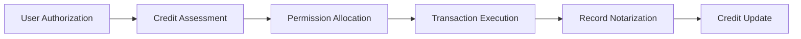

# Intelligent Payment Agent System

## I. Vision and Positioning
This system aims to build a new generation AI-driven payment infrastructure, integrating traditional payment systems with blockchain technology through intelligent agent technology. The system will act as a digital payment管家 for commercial entities, providing automated, traceable, and auditable payment solutions.

## II. Core Capabilities
### 1. Multi-platform Payment Aggregation
- Unified access to mainstream payment channels
- Dynamic routing to select optimal payment channels
- Automated currency conversion and multi-currency settlement
- Real-time payment status tracking and exception handling

### 2. On-chain Payment Innovation
- x402 protocol compatible smart contract payments
- Distributed payment authorization and multi-signature mechanisms
- On-chain certificate generation and notarization
- Transaction traceability and audit trail

## III. Agent Service Features
### 1. Trusted Execution Environment

### 2. Micro-payment Authorization System
- Tiered authorization mechanism (single transaction/daily limit)
- Dynamic credit scoring model
- Transaction behavior pattern learning
- Real-time anomaly transaction alerts

## IV. Credit Infrastructure
### Credit Evaluation Dimensions
| Dimension | Weight | Evaluation Method |
|---------|--------|-------------------|
| Historical Performance | 40% | Blockchain notarization records |
| Transaction Activity | 25% | Monthly transaction frequency |
| Risk Control | 20% | Anomaly transaction rate |
| Network Reputation | 15% | Distributed node evaluation |

### Credit Applications
- Dynamic payment limit adjustment
- Tiered transaction fees
- Priority payment channel access
- Dispute resolution priority

## V. Typical Application Scenarios
### 1. Automated E-commerce Settlement
- Smart price comparison and optimal payment solution recommendation
- Automatic cross-border payment conversion
- Order fulfillment automated guarantee

### 2. Corporate Expense Management
- Intelligent business travel expense control
- Departmental budget automated allocation
- Supplier payment process optimization

### 3. On-chain Financial Services
- DeFi protocol interaction agent
- On-chain asset automated liquidation
- Smart contract conditional payments

## VI. Technical Evolution Roadmap
1. **Infrastructure Phase**
   - Payment channel standardization
   - Core agent framework development
   - Basic credit model implementation

2. **Capability Expansion Phase**
   - Multimodal payment verification
   - Intelligent dispute arbitration
   - Cross-chain payment protocol development

3. **Ecosystem Building Phase**
   - Open agent market development
   - Distributed credit network creation
   - RegTech integration

[Demo reference](../src/terrazip/ai/README.md)

This system will continue to evolve, dedicated to building a trusted next-generation payment infrastructure that provides secure, intelligent, and efficient payment solutions for businesses and individuals.