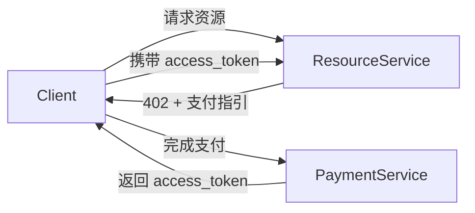

# Coinbase的X402可能还不够？

> 本文档用于说明一个基于 **X402 思想** 的完整支付流程实现与架构设想。  
> 代码层面的具体实现方式，从发起到收款验证，详见： [x402_mock](../src/terrazip/x402_mock/README.cn.md) 。

---

## ⚠️ 重要提示：模块已独立

> **该模块已经独立出来，地址为：https://github.com/OpenPayhub/x402-mock**  
> **最新的版本内容，请到此 repo 查看。**

---

## Coinbase X402实现机制

### 两次请求流程
1. **首次请求（不带支付凭证）**
   - 客户端发起资源访问请求
   - 服务端返回 `402 Payment Required`
   - 响应body包含支付方案(scheme)

2. **二次请求（携带支付凭证）**
   - 客户端根据返回信息在headers中提交支付凭证
   - 服务端验证凭证后提供资源访问

---

## 现有模式的一些值得讨论的地方

下面并不是对现有 X402 实现的否定，而是一些在实际工程和 agent 场景中，**可能值得进一步思考的问题**。

### 请求里同时放“付钱”和“拿资源”，是不是有点重？
- 单一端口同时处理支付验证与资源访问
- 是不是可以考虑，把 “我已经付过钱了” 和 “我现在来拿内容” 这两件事稍微拆开来看，会更清楚一些？

### 如果请求中途出问题，会不会让客户端有点“慌”？
- 在当前模式下
  客户端先付钱，再带着凭证请求资源
- 如果这个过程中:
  网络抖了一下
  服务端刚好重启
  agent 自己 crash 了
  客户端其实很难判断, 刚刚那笔钱，到底算不算已经被服务端认了
- 是不是可以考虑：
  先有一个“我已经付过钱”的确认
  再去做后面的事情
  这样对 agent 来说，心里会更踏实一点

### 只考虑链上支付，会不会限制了一些场景？
- 是不是可以提前把“支付方式”当成一个可替换的模块


---

## 改进型 X402 设计（一种可拆开的思路）

在延续 X402 「先返回 402，再引导客户端完成支付」这一基本思想的前提下，这里尝试探讨一种**把支付过程和资源访问稍微拆开**的实现方式。

这种拆分并不是为了复杂化流程，而是希望让每一步的职责更清楚，也让 agent 在实际运行时更容易处理异常情况。

---

### 一种更明确的 402 响应方式

当客户端首次请求资源、但尚未完成支付时，服务端仍然返回 `402 Payment Required`，但在响应中**尽量把“下一步该怎么付钱”说清楚**。

```http
HTTP/1.1 402 Payment Required
WWW-Authenticate: Bearer realm="terrazip", token_type="access_token"
Payment-Scheme: https://x402.terrazip/evm
Payment-Endpoint: https://pay.terrazip/x402
```

这里的想法是：

* `402` 仍然只表达一件事：**现在还不能访问**
* response header 里不直接要求“你现在就付”
* 而是告诉客户端：

  * 可以用什么支付方式
  * 去哪个地方完成支付

这样客户端（尤其是 agent）可以把“付钱”当成一个**独立步骤**来处理。

---

### 把“付钱”和“拿资源”稍微拆开

在这种设计里，可以把系统大致分成两块来看：



这里的拆分并不要求物理上一定是不同的服务或端口，
更多是一种**逻辑上的分工**：

* **Payment Service**

  * 只关心钱有没有付成功
  * 负责生成一个“可以用来访问资源的凭证”
* **Resource Service**

  * 不直接碰支付细节
  * 只验证凭证是否有效

是不是可以把复杂的状态处理，
都留在支付这一侧，
让资源侧尽量保持简单？

---

### access_token 的角色（一个中间结果）

在这个流程里，`access_token` 更像是：

> “这次支付已经被确认过了”的一个结果

而不是：

* 用户身份
* 登录态
* 长期凭证

它可以具备一些很朴素的特性：

* 有有效期
* 只能用于某一类资源
* 可以被重复校验
* 即使重复提交，也不会再次扣款

这样一来：

* 客户端重试请求，不需要重新付钱
* 服务端异常恢复后，也能继续认账

---

### 一些可能带来的好处（而不是保证）

这种拆开的方式，可能会带来一些工程上的便利：

* **流程更清楚**
  付钱失败、成功、超时，都有地方可查
* **更不容易重复扣款**
  因为“扣钱”和“访问”不再绑死在一次请求里
* **更容易扩展支付方式**
  链上、链下，甚至内部余额，都可以放在支付侧处理
* **对 agent 更友好**
  agent 可以把支付当成一个可恢复的步骤，而不是一次性的冒险动作

---

### 小结

这里的改进并不是要否定现有的 X402 思路，而是尝试回答一个问题：

> 当支付开始有状态、
> 当请求可能被重试、
> 当调用者变成 agent，
> 我们是不是可以让支付这一步，
> 在流程中“站得更稳一点”？

---

## 本项目的整体流程概览

本项目实现了一个完整的三段式流程：


## 延伸阅读

- Coinbase 对 X402 的探索与实现：
  https://github.com/coinbase/x402