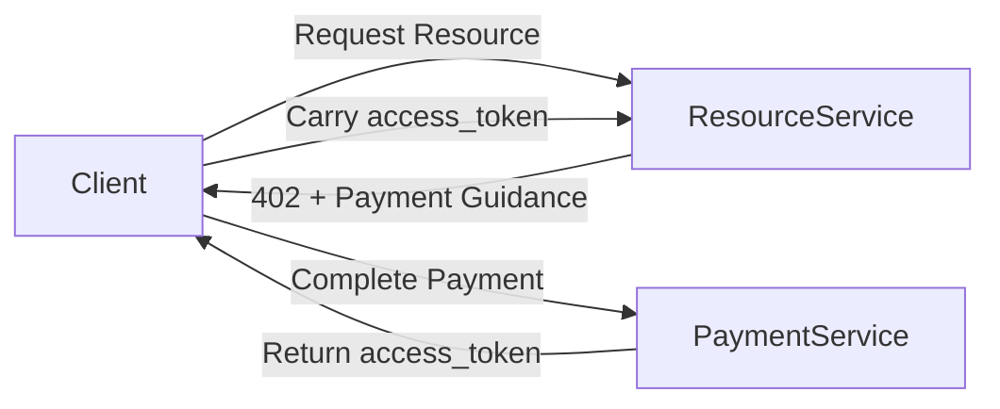

# Coinbase's X402 May Not Be Enough?

> This document describes a complete payment flow implementation and architecture vision based on the **X402 concept**.  
> For code-level implementation details from initiation to payment verification, see: [x402_mock](../src/terrazip/x402_mock/README.cn.md) .

---

## Coinbase X402 Implementation Mechanism

### Two-Request Process
1. **First Request (without payment credential)**
   - Client initiates resource access request
   - Server returns `402 Payment Required`
   - Response body contains payment scheme

2. **Second Request (with payment credential)**
   - Client submits payment credential in headers based on returned information
   - Server provides resource access after verifying credential

---

## Aspects Worth Discussing in Existing Models

The following points are not intended to negate existing X402 implementations, but rather to highlight **potential considerations for real-world engineering and agent scenarios**.

### Is Combining "Payment" and "Resource Retrieval" in One Request Too Heavy?
- Single port handles both payment verification and resource access
- Should we consider separating "I've already paid" and "I'm here to get content" for clearer processing?

### What If Something Goes Wrong Mid-Request?
- In current model:
  Client pays first, then requests resources with credential
- If during this process:
  Network fluctuates
  Server restarts
  Agent crashes
  Client can hardly determine if payment was recognized by server
- Should we consider:
  First confirming "I've paid"
  Then proceeding with subsequent actions
  This would make agents feel more secure

### Does Only Considering On-Chain Payments Limit Scenarios?
- Can we treat "payment methods" as replaceable modules upfront?

---

## Improved X402 Design (A Separable Approach)

While maintaining X402's core idea of "return 402 first, then guide client to complete payment", this section explores an implementation approach that **slightly separates payment process and resource access**.

This separation isn't meant to complicate the process, but to clarify each step's responsibilities and make exception handling easier for agents in real-world operations.

---

### A More Explicit 402 Response Method

When a client first requests resources but hasn't completed payment, the server still returns `402 Payment Required`, but in the response **clearly explains "how to pay next"**.

```http
HTTP/1.1 402 Payment Required
WWW-Authenticate: Bearer realm="terrazip", token_type="access_token"
Payment-Scheme: https://x402.terrazip/evm
Payment-Endpoint: https://pay.terrazip/x402
```

The idea here is:

* `402` still only expresses one thing: **Access not available yet**
* Response headers don't directly require "pay now"
* Instead, inform client:
  * What payment methods can be used
  * Where to complete payment

This allows clients (especially agents) to treat "payment" as an **independent step**.

---

### Separating "Payment" and "Resource Retrieval"

In this design, the system can be roughly divided into two parts:



This separation doesn't require physical different services or ports,
more of a **logical division**:

* **Payment Service**
  * Only cares if payment succeeded
  * Responsible for generating "resource access credential"
* **Resource Service**
  * Doesn't handle payment details directly
  * Only verifies credential validity

Can we keep complex state handling on the payment side,
keeping the resource side as simple as possible?

---

### The Role of access_token (An Intermediate Result)

In this flow, `access_token` resembles more:

> A result of "this payment has been confirmed"

Rather than:
* User identity
* Login status
* Long-term credential

It can have basic characteristics:
* Has expiration time
* Can only be used for specific resource types
* Can be repeatedly verified
* Won't cause double charges even if submitted repeatedly

This way:
* Client retries don't require re-payment
* Server can continue processing after exception recovery

---

### Potential Benefits (Not Guarantees)

This separated approach may bring engineering benefits:
* **Clearer workflow**
  Payment failures, successes, timeouts can all be tracked
* **Less likely to double charge**
  Since "payment" and "access" aren't tied to a single request
* **Easier payment method expansion**
  On-chain, off-chain, or internal balances can all be handled on payment side
* **Agent-friendly**
  Agents can treat payment as recoverable step, not one-time risk

---

### Summary

This improvement doesn't aim to negate existing X402 concepts, but tries to answer a question:

> When payments start having states,
> When requests may be retried,
> When callers become agents,
> Can we make the payment step
> "Stand more firmly" in the workflow?

---

## Project Workflow Overview

This project implements a complete three-stage flow:


## Further Reading

- Coinbase's X402 exploration and implementation:
  https://github.com/coinbase/x402