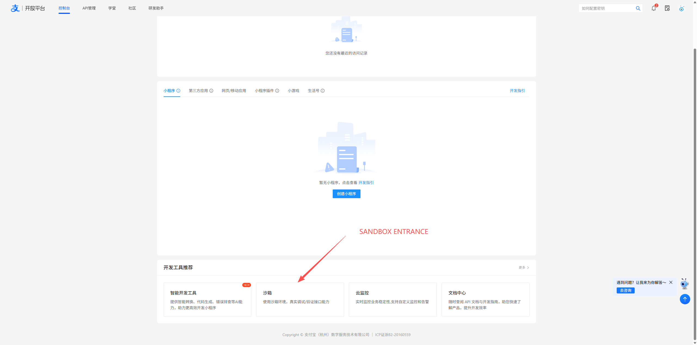
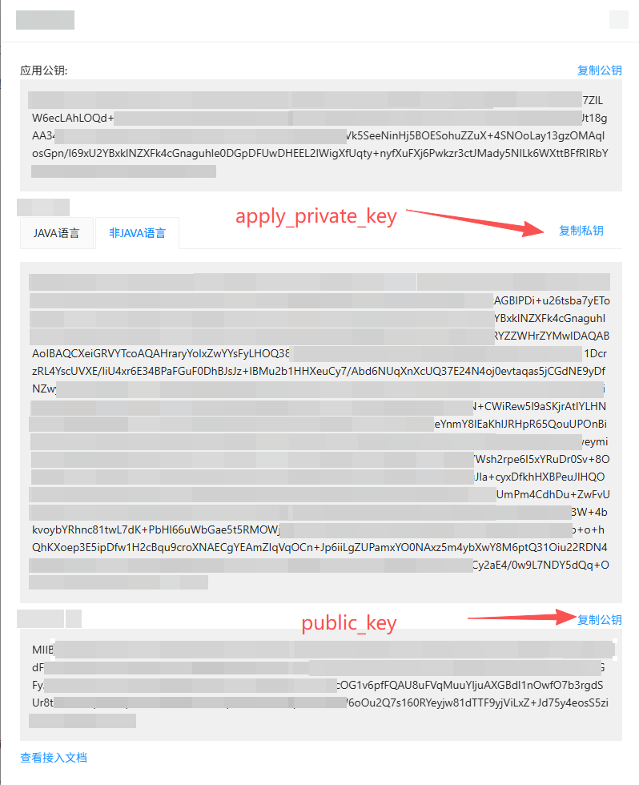

## 支付宝收款（Alipay Payment）

### 1. 环境变量配置

在使用支付宝收款功能前，请确保已正确配置以下环境变量：

```bash
ALIPAY_APP_ID=your_app_id
ALIPAY_APPLY_PRIVATE_KEY=your_app_private_key
ALIPAY_PUBLIC_KEY=alipay_public_key
```

| 变量名                        | 说明           |
| -------------------------- | ------------ |
| `ALIPAY_APP_ID`            | 支付宝开放平台应用 ID |
| `ALIPAY_APPLY_PRIVATE_KEY` | 商户应用私钥（RSA2） |
| `ALIPAY_PUBLIC_KEY`        | 支付宝公钥，用于回调验签 |

> ⚠️ 私钥请妥善保管，**不要提交到代码仓库**。

获取方式：

1. **第一步：[登录支付宝控制台]**
   

2. **第二步：[支付宝沙盒账户]**
   

3. **第三步：[支付宝需要配置的环境变量名]**
   

---

### 2. 支付宝收款整体流程

支付宝收款采用「**创建支付链接 + 异步回调确认**」的标准模式，整体流程如下：

1. **创建支付订单**

   * 调用 `create_order_payment_link`
   * 使用应用私钥（RSA2）对请求参数进行签名

2. **用户完成支付**

   * 用户通过浏览器或支付宝客户端打开付款链接
   * 完成支付操作

3. **异步通知（Webhook）**

   * 支付宝在支付结果确定后，向 `notify_url` 发送回调请求
   * 回调参数需使用 **支付宝公钥进行 RSA2 验签**

4. **订单状态校验**

   * 验签成功后，更新本地订单状态
   * 若长时间未收到回调，自动调用接口查询订单状态

5. **订单完成**

   * 支付成功 → 订单完成
   * 支付失败 / 超时 → 订单关闭或重试

---

### 3. 管理后台与沙盒环境

* **支付宝开放平台（正式环境）**
  [https://open.alipay.com/develop/manage](https://open.alipay.com/develop/manage)

* **沙盒环境（强烈建议先测试）**
  [https://open.alipay.com/develop/sandbox/app](https://open.alipay.com/develop/sandbox/app)

沙盒环境提供独立的 `app_id`、测试账号及密钥，用于完整模拟真实支付流程。

---

### 4. 接口与密钥要求

支付宝收款接口要求具备以下三项核心配置：

* `app_id`
* 应用私钥（RSA2）
* 支付宝公钥（用于回调验签）

密钥算法统一使用 **RSA2（SHA256WithRSA）**。

---

### 5. 支付链接构建规范

支付宝付款链接遵循 **标准 HTTP GET 参数拼接规则**，构建时需满足以下要求：

#### 5.1 参数格式

* 使用 `key=value` 形式组织参数
* 多个参数之间使用 `&` 连接

示例：

```
key1=value1&key2=value2
```

---

#### 5.2 参数排序

在进行签名与拼接前，所有参数必须：

* 按 **参数名 ASCII 码从小到大排序**
* 仅参与签名 **非空参数**

该规则用于确保签名结果的一致性。

---

#### 5.3 参数值编码（URL Encoding）

所有参数的 **value 部分必须进行 URL 编码（Percent-Encoding）**，尤其是以下字段：

* 金额
* 商品标题
* 中文或特殊字符

错误的编码会导致签名校验失败或请求被拒绝。

---

#### 5.4 动态拼接流程

标准的支付链接构建流程如下：

1. 以基础请求 URL 作为起点
2. 添加 `?` 作为参数起始符
3. 遍历参数映射表（Map / Dict）
4. 对参数排序、过滤空值
5. 对参数值进行 URL 编码
6. 使用 `&` 连接所有参数

---

### 6. 签名与安全说明

* 所有请求参数需使用 **应用私钥进行 RSA2 签名**
* 支付宝回调参数需使用 **支付宝公钥进行验签**
* 任何未通过验签的回调请求应直接丢弃

---

