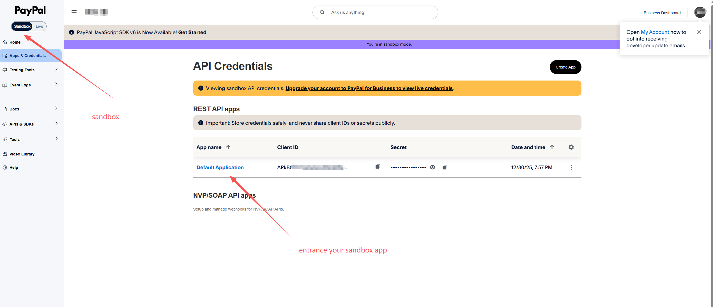
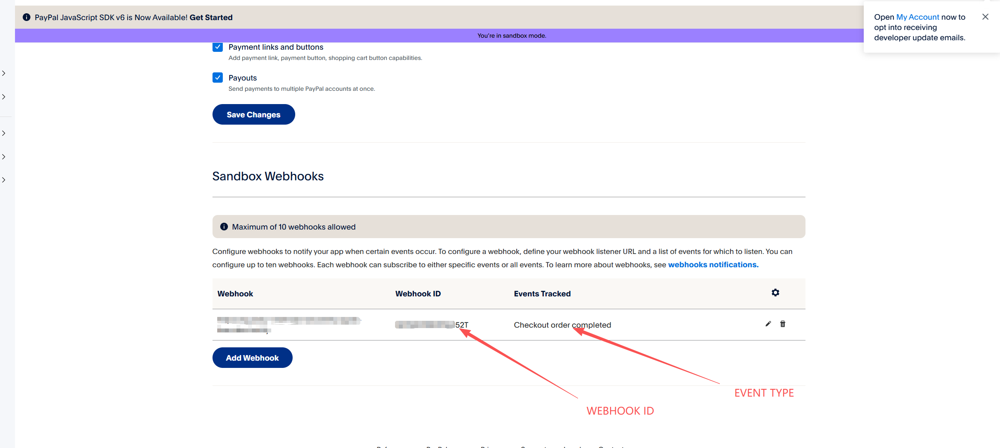

## PayPal 收款（PayPal Payment）

### 1. 环境变量配置

在使用 PayPal 收款功能前，请先配置以下环境变量：

```bash
PAYPAL_CLIENT_ID=your_client_id
PAYPAL_SECRET=your_client_secret
PAYPAL_WEBHOOK_ID=your_webhook_id
```

| 变量名                 | 说明                       |
| ------------------- | ------------------------ |
| `PAYPAL_CLIENT_ID`  | PayPal 应用 Client ID      |
| `PAYPAL_SECRET`     | PayPal 应用 Secret         |
| `PAYPAL_WEBHOOK_ID` | PayPal Webhook ID，用于回调验签 |

---
获取流程：
获取方式：

1. **第一步：[登录PayPal控制台]**
   

2. **第二步：[PayPal的webhook添加以及状态确认]**
   


---


### 2. PayPal 收款整体流程

PayPal 收款采用「**创建订单 → 用户支付 → 主动捕获 → Webhook 确认**」的模式，完整流程如下：

1. **获取 Access Token**

   * 使用 `client_id` 与 `secret`
   * 通过 OAuth2 接口获取 `access_token`

2. **创建订单（Create Order）**

   * 调用 `create_order` 接口
   * 返回 PayPal Checkout 支付链接

3. **用户完成支付**

   * 用户跳转至 PayPal 页面完成支付
   * 支付完成后返回成功页（Return URL）

4. **捕获订单（Capture Order）**

   * 在用户支付成功后触发 `capture_order`
   * 将订单状态从 `APPROVED` 转为 `COMPLETED`

5. **Webhook 异步通知**

   * PayPal 触发 `CHECKOUT.ORDER.COMPLETED` 事件
   * 向商户配置的 Webhook 地址发送通知

6. **订单状态校验**

   * 验证 Webhook 事件签名
   * 更新本地订单状态
   * 若 Webhook 丢失或支付超时，系统将主动查询订单状态进行兜底校验

7. **订单完成**

   * 支付成功 → 标记为成功
   * 支付失败 / 超时 → 标记为失败

---

### 3. Webhook 事件配置

PayPal Webhook 仅需订阅以下事件：

```
CHECKOUT.ORDER.COMPLETED
```

该事件表示订单已完成并成功捕获，可作为**最终支付成功的可信信号**。

---

### 4. 沙盒环境与测试

在接入生产环境前，**强烈建议先使用 PayPal 沙盒环境进行完整测试**：

* 沙盒账户管理地址
  [https://developer.paypal.com/dashboard/accounts](https://developer.paypal.com/dashboard/accounts)

沙盒环境提供独立的：

* Client ID / Secret
* 测试买家 / 卖家账号
* Webhook 配置

用于完整模拟真实支付流程。

---

### 5. 生产环境要求

在进入生产环境前，需完成以下准备：

* 注册并认证 **PayPal 商户账号**
* 创建正式应用（Live App）
* 配置生产环境 Webhook
* 获取正式 `PAYPAL_WEBHOOK_ID`

---

### 6. PayPalDriver 设计说明

`PayPalDriver` 对 PayPal 官方接口进行了封装，屏蔽不同阶段的复杂性，对外提供一致的调用方式。

#### 6.1 `init`

* 根据环境变量中的 `client_id` 与 `secret` 获取 `access_token`
* 验证 Webhook_ID 地址配置是否有效
* 初始化 PayPal API 客户端

---

#### 6.2 `create_order`

* 创建 PayPal 订单
* 返回用户可访问的 Checkout 支付链接
* 订单初始状态为 `CREATED`

---

#### 6.3 `capture_order`

* 在用户支付完成并跳转成功页后调用
* 将订单从 `CREATED` 状态捕获为 `CAPTURED`
* 捕获成功后等待 Webhook 异步确认

---

#### 6.4 `verify_webhook`

* 接收 `CHECKOUT.ORDER.COMPLETED` Webhook 事件
* 校验事件签名合法性
* 更新本地订单状态
* 判定订单最终状态（成功 / 失败）

> 若 Webhook 未正常触达或支付流程异常，系统将通过订单查询接口进行状态补偿校验。

---

### 7. 安全与可靠性说明

* 所有 PayPal API 请求均基于 OAuth2 `access_token`
* Webhook 必须进行签名校验，未通过校验的事件将被直接丢弃
* 订单最终状态以 **Webhook + 主动查询双重校验** 为准

---
