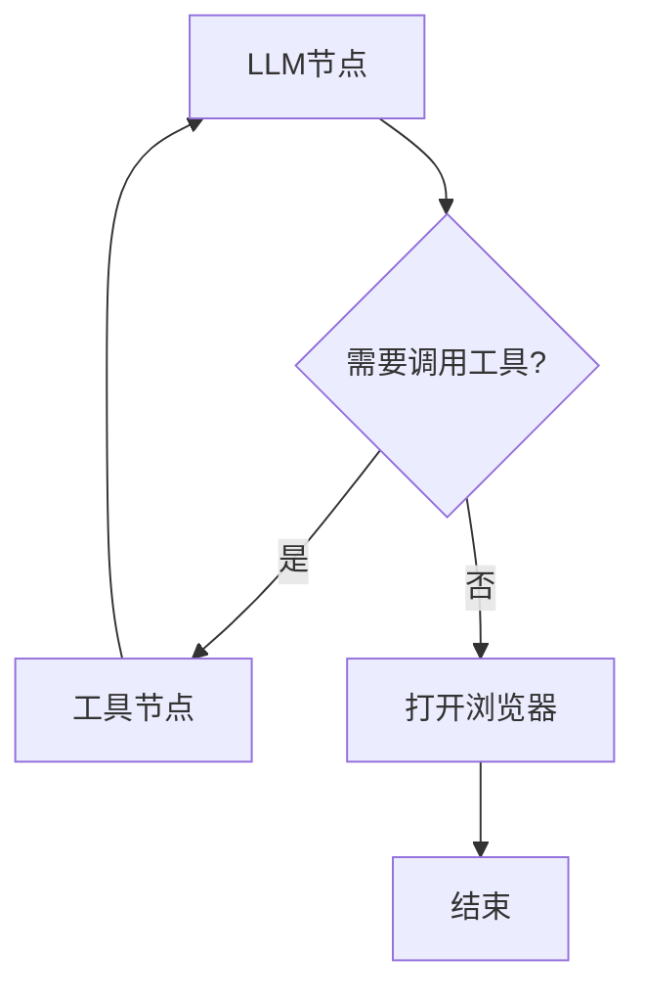

# AI支付代理系统 (LangGraph演示版)

## 概述
本项目是基于LangGraph框架构建的AI驱动支付系统演示原型，旨在展示如何通过智能代理实现传统支付与x402链上支付的自动化流程。系统采用模块化设计，支持主流支付渠道集成和智能合约支付协议。

## 架构设计
### 工作流结构


### 核心组件
1. **graph.py** - 流程控制器
   - 集成DeepSeek大语言模型
   - 实现三节点工作流（LLM处理/工具调用/支付执行）
   - 支持异步交互式对话
   ```python
   # 遵循 open_ai 的接口模式
   # 如果希望Agent执行支付demo，则需要先启动 x402_mock.servers.server 或者 TerrazipFastAPI.
   # 并且在tools_example.py中修改对应的port （默认本地域名为TerrazipFastAPI: http:localhost:5000/pay, x402_mock: http:localhost:3000）
   agent = PaymentAgent(
        env_path: str  # 模型api_key环境变量路径 
        key_name: str  # 模型名称, 
        model_base_url: str # 模型url, 
        model: str # 模型名称
   )
   asyncio.run(agent.run_chat()) # 运行agent
   
   ```   

2. **prompts.py** - 系统提示词模板
   - 定义双路径处理逻辑：
     - 产品查询路径：生成支付链接
     - 代理调度路径：触发x402支付协议

3. **state.py** - 状态管理
   ```python
   class PaymentAgentState(TypedDict):
       messages: Annotated[list, add_messages]  # 对话历史
       payment_url: Optional[str]              # 支付链接
       browser_opened: bool                    # 浏览器状态
       order_id: str                           # 订单标识
   ```

4. **tools_example.py** - 核心工具集
   - 支付工具：支付宝/微信/银联模拟接口
   - x402协议：链上支付适配器
   - 产品库：实时查询可用商品
   - 代理市场：智能代理调用接口

## 主要功能
### 支付工具
| 工具名称 | 功能说明 | 支付类型 |
|---------|----------|---------|
| terrazip_create_order | 生成支付订单 | 传统支付 |
| x402_pay_for_agents | 链上支付结算 | x402协议 |
| open_webbrowser | 自动打开支付链接 | 通用 |

### 代理服务(示例)
| 代理名称 | 核心能力 | 单价(USDC) |
|---------|----------|-----------|
| alpha_research_agent | 量化研究 | 0.5 |
| onchain_analytics_agent | 链上分析 | 0.35 |
| sentiment_monitor_agent | 情绪监测 | 0.25 |

## 使用指南
1. 安装依赖：
```bash
uv sync --extra ai
```

2. 配置API密钥：
可根据自己偏好的模型提供api，参数可以在 "PaymentAgent"调用中修改
```bash
# 修改.env.ai文件
DEEPSEEK_API_KEY=your_api_key
```

3. 启动服务：
```bash
uv run -m src.terrazip.ai.graph.py
```

## 未来扩展
- 集成真实支付网关
- 扩展更多金融代理服务
- 实现多语言支持
- 增加安全审计模块

## 技术特点
- 基于LangGraph的状态管理
- 异步流式响应处理
- 模块化工具设计
- 双支付通道支持