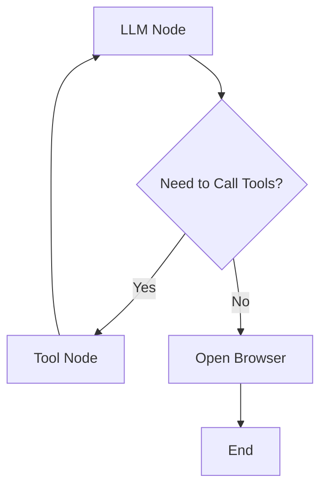

# AI Payment Agent System (LangGraph Demo)

## Overview
This project is an AI-driven payment system prototype built on the LangGraph framework, demonstrating how intelligent agents can automate traditional payment and x402 blockchain payment workflows. The system features a modular design supporting integration with mainstream payment channels and smart contract payment protocols.

## Architecture Design
### Workflow Structure


### Core Components
1. **graph.py** - Workflow Controller
   - Integrates DeepSeek large language model
   - Implements 3-node workflow (LLM processing/tool calling/payment execution)
   - Supports asynchronous interactive conversations
   ```python
   # Follows open_ai interface pattern
   # To run payment demo, first start x402_mock.servers.server or TerrazipFastAPI
   # Also modify corresponding port in tools_example.py (default domains: TerrazipFastAPI: http://localhost:5000/pay, x402_mock: http://localhost:3000)
   agent = PaymentAgent(
        env_path: str  # Model API_KEY environment path 
        key_name: str  # Model name 
        model_base_url: str # Model URL 
        model: str # Model version
   )
   asyncio.run(agent.run_chat())  # Run agent
   ```

2. **prompts.py** - System Prompt Templates
   - Defines dual-path processing logic:
     - Product query path: Generate payment links
     - Agent dispatch path: Trigger x402 payment protocol

3. **state.py** - State Management
   ```python
   class PaymentAgentState(TypedDict):
       messages: Annotated[list, add_messages]  # Conversation history
       payment_url: Optional[str]              # Payment link
       browser_opened: bool                    # Browser status
       order_id: str                           # Order identifier
   ```

4. **tools_example.py** - Core Toolset
   - Payment tools: Alipay/WeChat/UnionPay simulation interfaces
   - x402 protocol: Blockchain payment adapter
   - Product database: Real-time available product queries
   - Agent marketplace: Intelligent agent calling interface

## Key Features
### Payment Tools
| Tool Name | Function Description | Payment Type |
|---------|----------|---------|
| terrazip_create_order | Generate payment order | Traditional Payment |
| x402_pay_for_agents | Blockchain settlement | x402 Protocol |
| open_webbrowser | Automatically open payment link | Universal |

### Agent Services (Examples)
| Agent Name | Core Capability | Price (USDC) |
|---------|----------|-----------|
| alpha_research_agent | Quantitative Research | 0.5 |
| onchain_analytics_agent | Blockchain Analytics | 0.35 |
| sentiment_monitor_agent | Sentiment Monitoring | 0.25 |

## User Guide
1. Install dependencies:
```bash
uv sync --extra ai
```

2. Configure API Key:
Use your preferred model API, modify parameters in "PaymentAgent" call:
```bash
# Edit .env.ai file
DEEPSEEK_API_KEY=your_api_key
```

3. Start service:
```bash
uv run -m src.terrazip.ai.graph.py
```

## Future Extensions
- Integrate real payment gateways
- Expand financial agent services
- Implement multilingual support
- Add security audit modules

## Technical Features
- LangGraph-based state management
- Asynchronous streaming response handling
- Modular tool design
- Dual payment channel support